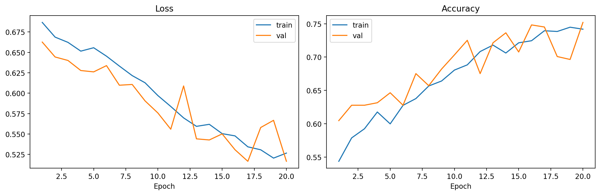
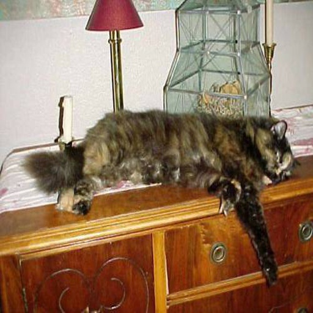
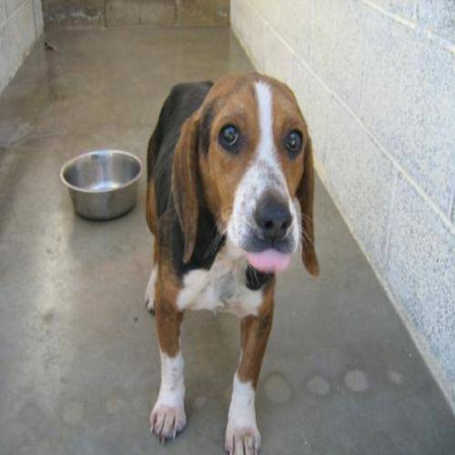

# Cat vs Dog CNN


Proyecto de clasificacion de imagenes con una CNN simple entrenada desde cero sobre el dataset `tongpython/cat-and-dog` de Kaggle.

## Dataset

- Fuente: https://www.kaggle.com/datasets/tongpython/cat-and-dog
- Ruta local usada para entrenamiento: `dataset/training_set/training_set`
- Clases: `cats`, `dogs`

## Flujo

1. Exportar `KAGGLE_USERNAME` y `KAGGLE_KEY`.
2. Descargar el dataset con `download_dataset.py`.
3. Entrenar una CNN simple con `train_cnn.py`.
4. Guardar el historial en `outputs/history.json` y la grafica en `outputs/history.png`.
5. Guardar el modelo final en `models/cnn_cat_dog.pt`.
6. Generar dos imagenes de ejemplo en `assets/`.

### Comandos

```bash
python download_dataset.py
python train_cnn.py --epochs 1
python train_cnn.py --epochs 20
```

## Entrenamiento

La red usa solo capas convolucionales basicas, pooling, `AdaptiveAvgPool2d` y una cabeza densa final. No usa pesos preentrenados.

### Resultados

Se ejecutaron dos corridas:

- `1 epoch` como prueba rapida: `train_acc=0.5436`, `val_acc=0.6046`
- `20 epochs` como resultado final: `train_acc=0.7419`, `val_acc=0.7520`

### Resumen final

- `train_loss`: `0.5267`
- `train_acc`: `0.7419`
- `val_loss`: `0.5166`
- `val_acc`: `0.7520`

### Historial



### Ejemplos





## Artefactos

- Modelo: `models/cnn_cat_dog.pt`
- Historial: `outputs/history.json`
- Grafica: `outputs/history.png`

## Notas

- El entrenamiento se ejecuto en GPU con `torch`.
- Se filtraron imagenes corruptas del dataset durante la carga.
