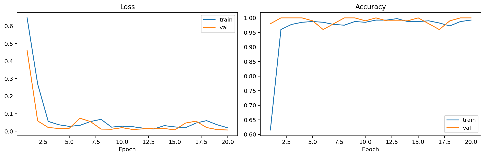

# Test_LLM

Proyecto de clasificación de imágenes con una CNN simple en PyTorch.

## Dataset

Se usó el dataset de Kaggle:

`mattop/panda-or-bear-image-classification`

La descarga reproducible queda en `dataset/` y la raíz real de entrenamiento usada por el script es:

`dataset/PandasBears/Train`

## Scripts

`download_dataset.py`
- Descarga y descomprime el dataset en `dataset/`.

`train_cnn.py`
- Entrena una CNN simple.
- Guarda `history.json`, `history.csv`, `history.png` y `model.pth`.
- Exporta 1 imagen de train por clase en `outputs/.../assets/`.

## Ejecución

Smoke test:

```bash
conda run -n fagos_ESM python train_cnn.py --data-dir dataset --output-dir outputs/sanity --epochs 1
```

Entrenamiento final:

```bash
conda run -n fagos_ESM python train_cnn.py --data-dir dataset --output-dir outputs/final --epochs 20
```

## Resultados

### 1 epoch

- `train_loss`: `0.6463`
- `train_acc`: `0.6150`
- `val_loss`: `0.4593`
- `val_acc`: `0.9800`

### 20 epochs

- `train_loss`: `0.0190`
- `train_acc`: `0.9925`
- `val_loss`: `0.0064`
- `val_acc`: `1.0000`
- `best_val_acc`: `1.0000`

## Imágenes

### Train - Bears


### Train - Pandas


### History



## Artefactos

- Modelo: `outputs/final/model.pth`
- History: `outputs/final/history.json`
- Gráfica: `outputs/final/history.png`

## Entorno

Se validó el uso de `conda env` `fagos_ESM` y entrenamiento en GPU con PyTorch.
